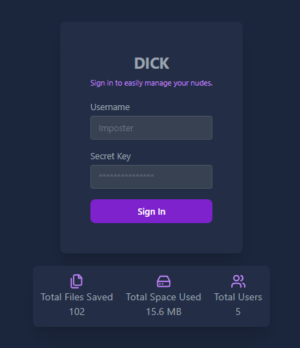
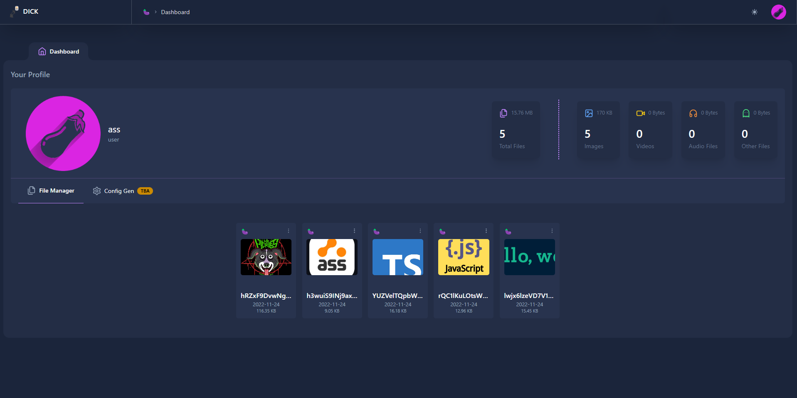

<br />
<p align="center">
  <a href="assets/dick_example_2.png">
    
  </a>
  <details align="center">
  <summary>Profile Preview</summary>
    <a href="assets/dick_example_1.png">
    
  </a>
  </details>

  <h3 align="center">DICK (Directly Integrated Client for Keisters)</h3>

  <p align="center">
    The main repository for DICK, an <a href="https://github.com/tycrek/ass">ASS</a> front end
    <br />
    <br />
    <a href="https://github.com/facinorous-420/dick/issues">Report Bug</a>
    ·
    <a href="https://github.com/facinorous-420/dick/issues">Request Feature</a>
  </p>
</p>

<!-- TABLE OF CONTENTS -->
<details open="open">
  <summary>Table of Contents</summary>
  <ol>
    <li><a href="#about-the-project">About The Project</a></li>
    <li><a href="#running-the-dashboard">Running The Dashboard</a>
      <ul>
        <li><a href="#config">Config</a></li>
          <ul>
            <li><a href="#development">Starting Development</a></li>
            <li><a href="#production">Starting Production</a></li>
          </ul>
        </ul>
    </li>
    <li>
      <a href="#contributing">Contributing</a>
    </li>
    <li>
      <a href="#contact">Contact</a>
    </li>
    <li>
      <a href="#acknowledgements">Acknowledgements</a>
    </li>
  </ol>
</details>


## About The Project

Dick was created to be an easy to use front end for <a href="https://github.com/tycrek/ass">Ass</a> as there was no public option to allow users to view their saved images on their server. I decided to learn tailwind and also at the same time build this. I did this all in my spare time, and will keep updating as best as I can while I use it. I'm still learning all this so if anyone has suggestions on how to do things better, I am all ears! I love learning! :)

**Current Feautres:**
1. General statistics on your file uploads
2. File browser, allows you to see all your uploads on one webpage (plans to make it more powerful)
3. Deletion of items (currently one at a time, plans for multiple at once)
4. Copy link of items (currently one at a time, plans for multiple with spaces in between in pastebin)
5. Customize DICK

**Planned Feautres:**
1. There are a lot of good ideas out there, to keep track of what is currently planned see <a href="https://github.com/Facinorous-420/dick/projects/2">the v1.1 project board</a>

The front end is built using <a href="https://tailwindcss.com">Tailwind CSS</a>, <a href="https://lucide.dev/">Lucide Icons,</a> as well as hand crafted components all templated using <a href="https://ejs.co/">EJS</a>. I plan to eventually rewrite this in React.

The back end is written in <a href="https://www.typescriptlang.org/">Typescript</a>, utilizing <a href="https://expressjs.com/">expressJS</a>.


## Running The Dashboard

Running DICK is very simple, though there is no docker container.<br/>
You must have `Node >=v16.14.0`, which you should if you're running ASS.<br/>
**NOTE:** DICK requires you to use JSON for ASS' database.

### Config

Inside of your dick root folder, you will see `src/CONSTANTS.ts.example`. Copy this to `CONSTANTS.ts`<br/>
Inside this file, is some basic configuration you can change for your set up. There are only 5 variables you need to worry about in this file:

| Variable                                     |           Description           |
| --------------------------------------------- | :---------------------: |
| `DICK_SUBMODULE = false` | Put this to true if you wish to run DICK as an ASS submoduke, false if seperate                 |
| `ASS_LOCATION = "../ass"` | If running DICK seperately, DICK will use this to find your ASS install folder |
| `ASS_SECURE = false` | Put this to true if you are running ASS behind a domain with HTTPS,. false if HTTP                  |
| `ASSDOMAIN = "127.0.0.1:40115"` | Put this to your ASS domain. Can be an ip, or domain for example `https://cdn.mydomain.com` |
| `STAFF_IDS = ["ass"]` | Change this to whatever your username is in your ASS `auth.json` file. Default user in ASS, is `ass` |
| `PORT = "3000"` | Change this number to the port you wish DICK to run on |

### Running

#### Development

<details>
    <summary>
      <sub>Open to view the development set up steps</sub>
    </summary>

  1. Create a folder, call it whatever you wish
  2. Install, and run ASS https://github.com/tycrek/ass#installation (This will create an `ass` folder) 
  3. Go back into the folder you created and clone this repo `git clone https://github.com/Facinorous-420/dick`
  4. Go into the newly created `dick` folder `cd dick`
  5. Go into `/src` and copy `CONSTANTS.ts.example` to `CONSTANTS.ts` and edit it as needed
  6. Go back to the root of `dick` and install the dependancies for the frontend, `npm i`
  7. Run `npm run build:dev` to compile the code base in watch mode
  8. In a new terminal, run `npm run serve:dev` to run DICK using nodemon
  
:warning:```ASS will be running under it's port of 40115 whereas the dashboard will be under the port 3000.```<br/>
</details>
  
#### Production
<details>
    <summary>
      <sub>Open to view the production set up steps</sub>
    </summary><br/>

  1. Create a folder, call it whatever you wish
  2. Install, and run ASS https://github.com/tycrek/ass#installation (This will create an `ass` folder) 
  3. Go back into the folder you created and clone this repo `git clone https://github.com/Facinorous-420/dick.git`
  4. Go into the newly created `dick` folder `cd dick`
  5. Go into `/src` and copy `CONSTANTS.ts.example` to `CONSTANTS.ts` and edit it as needed
  6. Go back to the root of `dick` and install the dependancies for the frontend, `npm i`
  7. Run `npm start` to compile the code base and run DICK

</details>

When you approach the login screen, the login information is your ASS username, and the secret key generated by ASS is your password.
The first user to login will be added to the instance admin list.

:warning:```ASS and the dashboard will be under their own ports.```<br/>
<sub> They will have entirely different routing. This means you can use two different domains for each, such as `cdn.yourdomain.com` for ASS and `dashboard.yourdomain.com` for DICK. </sub>

## Contributing

<sub> If using VSCode, I'd recommend using this extension: https://marketplace.visualstudio.com/items?itemName=GitHub.vscode-pull-request-github</sub>

1. Fork the Project
2. Create your Feature Branch (`git checkout -b feature/AmazingFeature`)
3. Commit your Changes (`git commit -m 'Add some AmazingFeature'`)
4. Push to the Branch (`git push origin feature/AmazingFeature`)
5. Open a Pull Request


## Contact

| Developer                                     |           Job           |
| --------------------------------------------- | :---------------------: |
| [Facinorous](https://github.com/facinorous-420) | Lead                  |
| [Sublime](https://github.com/senpaiSubby)#4233 | Helping hand, my sensei, created the back end |
